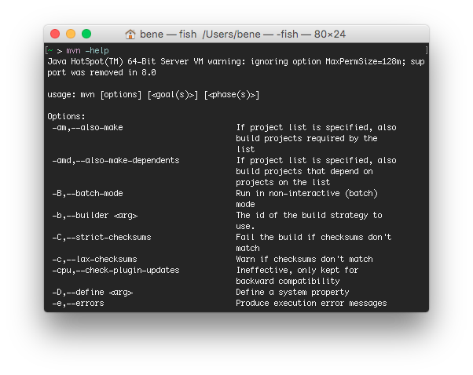

<!-- .slide: data-background="img/background-violet-orig.jpg" data-state="intro" class="center" -->
## Komponenten <!-- .element: class="heading" style="text-align: center;"-->
### Apache Commons CLI <!-- .element: class="heading" style="text-align: center;"-->

---

### Motivation

What I want:

<!-- .slide: class="center" -->



---

### Motivation

What Java gives me:

```
public static void main(String[] args) {
  if(args.length > 0) {
    if("-help".equals(args[0])) {
      printHelp()
    }
  }
}
```

---

### 